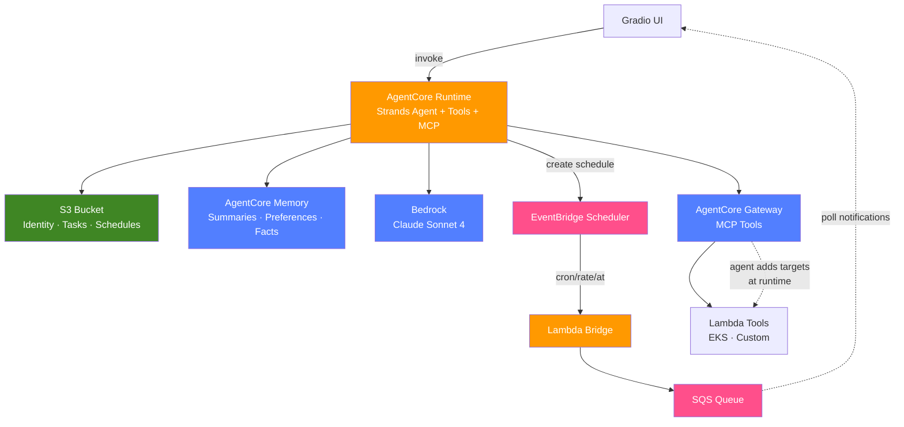

# OpenClaw AWS Agent

An AI agent inspired by [OpenClaw](https://github.com/kustomzone/OpenClaw)'s identity-driven architecture — rebuilt on AWS managed services. Identity in S3, memory in AgentCore, scheduling via EventBridge, and self-extending tools through AgentCore Gateway.

One `cdk deploy`. No databases. No servers.

## What It Does

- Loads personality from S3 identity files (SOUL.md, AGENTS.md)
- Remembers you across sessions via AgentCore Memory (summaries, preferences, facts)
- Manages tasks and schedules through natural conversation
- Sends proactive reminders via EventBridge → Lambda → SQS
- Extends its own capabilities by creating Lambda tools and registering them on the Gateway
- Connects to AWS services (EKS, S3, etc.) through AgentCore Gateway MCP

## Quick Start

```bash
# Clone and install
git clone https://github.com/lusoal/openclaw-redesign-awsbedrock.git
cd openclaw-redesign-awsbedrock
python -m venv venv && source venv/bin/activate
pip install -e ".[dev,infra]"

# Deploy everything
cd infra && pip install -r requirements.txt
cdk bootstrap
cdk deploy

# Upload identity files
BUCKET=$(aws cloudformation describe-stacks \
  --stack-name my-agent-infra \
  --query 'Stacks[0].Outputs[?OutputKey==`IdentityBucketName`].OutputValue' \
  --output text)
aws s3 cp identity_files/SOUL.md s3://$BUCKET/agents/my-agent/SOUL.md
aws s3 cp identity_files/AGENTS.md s3://$BUCKET/agents/my-agent/AGENTS.md

# Launch the UI (connects to deployed AgentCore Runtime)
cd ..
python chat_ui.py --agent-id my-agent
```

## Architecture



## What Gets Deployed

| Resource | Purpose |
|---|---|
| S3 Bucket | Identity files, tasks, schedules (encrypted, versioned) |
| AgentCore Memory | Summarization, user preference, and semantic strategies |
| AgentCore Runtime | Containerized agent (BedrockAgentCoreApp) |
| AgentCore Gateway | MCP endpoint for extensible tools (IAM auth) |
| Lambda (scheduler-invoker) | Bridges EventBridge → SQS for notifications |
| Lambda (gateway-tools) | Sample AWS tools (S3, Lambda, STS) |
| SQS Queue | Delivers scheduled reminders to the UI |
| EventBridge Schedule Group | Agent-managed cron schedules |
| IAM Roles | Least-privilege for runtime, scheduler, Lambda, Gateway |
| SSM Parameters | Runtime config at `/{agent_id}/config/*` |

## Tools

| Tool | What it does |
|---|---|
| `manage_tasks` | CRUD for personal tasks in S3 |
| `schedule_task` | Create/list/delete EventBridge schedules (supports `rate()`, `cron()`, `at()` for one-time) |
| `manage_gateway_tools` | Self-extending: add AWS services or custom Lambda tools to the Gateway at runtime |
| `update_identity` | Agent updates its own IDENTITY.md |
| `update_user_profile` | Agent learns about you (USER.md) |
| `save_to_memory` | Persist info to MEMORY.md |
| `search_memory` | Search AgentCore Memory |
| `get_current_date` | Current UTC timestamp |
| Gateway MCP tools | Dynamically added — EKS, S3, custom Lambdas, etc. |

## Self-Extending Agent

The agent can add new capabilities through conversation:

```
You: I need to list my EKS clusters
Agent: I'll create a tool for that.
       → Creates Lambda with boto3 EKS code
       → Registers it as a Gateway target
       → Tool is available on next invocation

You: List my EKS clusters
Agent: Found 2 clusters:
       - eks-production (ACTIVE, v1.31)
       - eks-staging (ACTIVE, v1.30)
```

The `manage_gateway_tools` tool supports:
- `add-aws-service` — downloads Smithy model, registers as Gateway target
- `add-lambda` — agent writes Python code, deploys Lambda, registers as Gateway target
- `list` — shows all Gateway targets
- `remove` — deletes a target

## Identity Files

Stored in S3 at `agents/{agent_id}/`:

| File | Required | Purpose |
|---|---|---|
| `SOUL.md` | Yes | Core personality and directives |
| `AGENTS.md` | Yes | Tool documentation and usage instructions |
| `IDENTITY.md` | No | Self-conception (agent updates this) |
| `USER.md` | No | What the agent knows about you |
| `MEMORY.md` | No | Curated long-term knowledge |

## Memory

AgentCore Memory provides three strategies:
- Summarization — condenses past sessions
- User Preference — tracks your preferences
- Semantic — extracts facts and knowledge

Memory persists across sessions automatically. The Strands `session_manager` handles the integration natively.

## Scheduling

Supports three expression types:
- `rate(5 minutes)` — recurring interval
- `cron(0 9 ? * MON-FRI *)` — recurring cron
- `at(2026-04-10T14:30:00)` — one-time (auto-deletes after firing)

EventBridge → Lambda → SQS → UI notification panel.

## Configuration

SSM Parameters (deployed) with environment variable fallback (local dev):

| SSM Parameter | Env Var |
|---|---|
| `/{id}/config/bucket-name` | `IDENTITY_BUCKET` |
| `/{id}/config/bedrock-model-id` | `BEDROCK_MODEL_ID` |
| `/{id}/config/memory-id` | `MEMORY_ID` |
| `/{id}/config/gateway-url` | `GATEWAY_URL` |
| `/{id}/config/gateway-id` | `GATEWAY_ID` |
| `/{id}/config/schedule-group-name` | `SCHEDULE_GROUP_NAME` |
| `/{id}/config/scheduler-role-arn` | `SCHEDULER_ROLE_ARN` |
| `/{id}/config/scheduler-target-arn` | `SCHEDULER_TARGET_ARN` |
| `/{id}/config/agent-runtime-arn` | `AGENT_RUNTIME_ARN` |
| `/{id}/config/custom-tool-role-arn` | `CUSTOM_TOOL_ROLE_ARN` |

## Testing

```bash
pytest tests/ -v
```

## Project Structure

```
├── main.py                        # AgentCore Runtime entrypoint (BedrockAgentCoreApp)
├── Dockerfile                     # Container image for deployment
├── requirements.txt               # Runtime dependencies
├── pyproject.toml                 # Project metadata and dev dependencies
├── chat_ui.py                     # Gradio UI (calls deployed AgentCore Runtime)
├── run_tests.py                   # Test runner helper
├── BLOG.md                        # Blog post about the architecture
├── agent/
│   ├── main.py                    # _build_components, handle_invocation, CLI
│   ├── orchestrator.py            # Ties identity, memory, tools, LLM together
│   ├── identity.py                # S3 identity file management
│   ├── memory.py                  # Memory wrapper (degraded mode fallback)
│   ├── config.py                  # SSM / env var config (batched reads)
│   ├── heartbeat.py               # EventBridge heartbeat handler
│   ├── model_router.py            # Bedrock model selection + prompt routing
│   ├── models.py                  # Pydantic data models
│   ├── chat_ui.py                 # Local-only Gradio UI (for dev without AgentCore)
│   └── tools/
│       ├── __init__.py            # ToolRegistry
│       ├── _decorator.py          # @tool decorator (Strands with fallback)
│       ├── tasks.py               # manage_tasks
│       ├── schedules.py           # schedule_task (rate/cron/at)
│       ├── gateway_tools.py       # manage_gateway_tools (self-extending)
│       ├── identity_tools.py      # update_identity, update_user_profile, save_to_memory
│       ├── memory_tools.py        # search_memory
│       └── utils.py               # get_current_date
├── identity_files/                # Sample identity files for upload to S3
│   ├── SOUL.md
│   ├── AGENTS.md
│   ├── IDENTITY.md
│   ├── USER.md
│   └── MEMORY.md
├── infra/
│   ├── app.py                     # CDK app entry point
│   ├── cdk.json                   # CDK context configuration
│   ├── requirements.txt           # CDK dependencies
│   ├── stacks/
│   │   └── agent_stack.py         # All AWS resources in one CDK stack
│   └── lambda/
│       ├── scheduler_invoker.py   # EventBridge → SQS bridge (auto-cleanup)
│       └── gateway_tools.py       # Sample Gateway Lambda tools
└── tests/                         # Unit + property-based tests (pytest + hypothesis)
```
